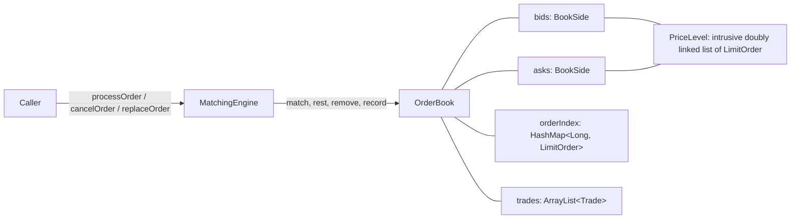

# MatchBooks: a Java limit order book matching engine

An in-memory matching engine for a single instrument, written from scratch in Java 21 to learn how
electronic exchanges work. It implements **price-time priority** matching for limit and market orders
with GTC / IOC / FOK time-in-force, cancel and replace, integer-tick prices, market-depth snapshots,
and a test suite that includes a randomised comparison against a deliberately naive reference model.

It is a library plus a small demo (`Main`). It is single-threaded and not a network service.

---

## Features

- Limit and market orders, BUY and SELL
- **Price-time priority**: best price first; first come, first served within a price
- Trades execute at the **resting order's price** (the incoming order can get price improvement)
- Partial and full fills across any number of price levels
- Time-in-force: **GTC** (rest the remainder), **IOC** (discard the remainder), **FOK** (all or nothing)
- **Cancel** in O(1), and **replace** (reducing size at the same price keeps queue position)
- Every order returns an **`ExecutionResult`**: status, filled/remaining quantity, its own trades, reject reason
- Validation with explicit reject reasons (no exceptions for bad orders)
- Prices are **`long` ticks**; `PriceScale` converts to and from decimals at the edge
- Trade ids, aggressor side, injectable `Clock`, immutable depth snapshots
- JUnit 5 tests, randomised differential test, JaCoCo coverage gate, JMH benchmarks, GitHub Actions CI

---

## Quick start

Requirements: **JDK 21+** and Maven 3.9+.

```bash
mvn verify          # compile, run all tests, enforce the 90% line-coverage gate
```

```java
PriceScale cents = new PriceScale(2);            // 1 tick = 0.01
OrderBook book = new OrderBook(cents);
MatchingEngine engine = new MatchingEngine(book);

engine.processOrder(new LimitOrder(1, Side.SELL, 20, cents.toTicks("100.00")));
engine.processOrder(new LimitOrder(2, Side.SELL, 30, cents.toTicks("100.00")));
engine.processOrder(new LimitOrder(3, Side.SELL, 40, cents.toTicks("101.00")));

ExecutionResult result =
        engine.processOrder(new LimitOrder(4, Side.BUY, 60, cents.toTicks("101.00")));

result.status();            // FILLED
result.filledQuantity();    // 60
result.trades();            // 20 @ 100.00, 30 @ 100.00, 10 @ 101.00

book.depth(5).asks();       // [LevelView[price=10100, quantity=30, orderCount=1]]
```

Order 4 was willing to pay 101 but paid 100 for the first 50 units: trades happen at the resting
order's price. Order 1 traded before order 2 because they share a price and 1 arrived first.

---

## Order model

| | GTC | IOC | FOK |
|---|---|---|---|
| **Limit** | trade what crosses; the remainder **rests** | trade what crosses; the remainder is **discarded** | trade only if the **whole** quantity can fill at the limit price or better, else nothing happens |
| **Market** | **rejected** (a market order cannot rest) | sweep the book; the remainder is discarded | trade only if the whole opposite side can supply the quantity, else nothing happens |

Convenience constructors: `new LimitOrder(id, side, qty, price)` is GTC; `new MarketOrder(id, side, qty)` is IOC.

### `ExecutionResult`

| `status` | Meaning |
|---|---|
| `FILLED` | nothing remains |
| `RESTING` | the remainder is in the book (some quantity may also have traded) |
| `CANCELLED` | the remainder was discarded (IOC, market, or a FOK that could not fully fill) |
| `REJECTED` | the order was invalid and never touched the book; see `rejectReason` |

`rejectReason`: `INVALID_SIDE`, `MISSING_TIME_IN_FORCE`, `INVALID_TIME_IN_FORCE`, `INVALID_QUANTITY`,
`INVALID_PRICE`, `DUPLICATE_ID`, `UNKNOWN_ORDER`.

### Public API

| Class | Main methods |
|---|---|
| `MatchingEngine` | `processOrder(Order)`, `cancelOrder(id)`, `replaceOrder(id, newQty, newPrice)` |
| `OrderBook` | `bestBid()`, `bestAsk()`, `hasBid()`, `hasAsk()`, `getBestBidOrder()`, `getBestAskOrder()`, `depth(n)`, `getTrades()`, `cancelOrder(id)`, `printOrderBook()`, `printTrades()` |
| `PriceScale` | `toTicks("100.25")`, `format(10025)` |

`replaceOrder`: reducing the quantity at the same price keeps the order's place in the queue. Any other
change (price change or size increase) cancels it and resubmits it at the back of the line, where it may
trade immediately.

---

## Architecture



- **`MatchingEngine`** validates, runs the fill-or-kill check, runs **one** matching loop for both sides,
  rests any GTC remainder, and builds the `ExecutionResult`.
- **`OrderBook`** owns the two sides, the id index, the trade history and the trade-id sequence.
- **`BookSide`** keeps price levels in a `TreeMap` ordered so the first entry is always the best price
  (bids high to low, asks low to high), plus a cached reference to the best level.
- **`PriceLevel`** is an intrusive doubly linked list (the `LimitOrder` objects are the nodes) that also
  keeps the level's order count and total quantity up to date.

### Complexity

P = price levels on a side. All figures are for the implementation as written.

| Operation | Cost |
|---|---|
| Best bid / best ask / best order | O(1) (cached best level) |
| Add a resting order | O(log P) (one `TreeMap` lookup to find the level; the append is O(1)) |
| One fill | O(1); O(log P) when the fill empties a price level |
| Cancel | O(1); O(log P) when it removes the last order at a price |
| Replace, quantity reduced at the same price | O(1) |
| FOK / market-FOK feasibility check | O(price levels examined) |
| Depth snapshot of k levels | O(k) |

### Why these structures

| Choice | Instead of | Reason |
|---|---|---|
| `TreeMap` per side, best level cached | heap, sorted array, skip list | needs sorted traversal, cheap removal of arbitrary levels, and no concurrency overhead |
| Intrusive linked list per level | `LinkedList`, `ArrayDeque`, `LinkedHashMap` | O(1) cancel from the middle without scanning or extra node objects |
| `long` ticks | `double`, `BigDecimal` | exact equality for map keys, cheap comparison, no rounding |
| Result object | `void` + inspecting the book | the caller needs a complete, per-order answer |
| Reject as a value | exceptions | bad orders are a normal outcome, not an exceptional failure |
| One matching loop | separate buy / sell methods | a rule is changed once; only the price comparison differs by side |
| Single-threaded core | locks, concurrent collections | matching is a sequential state machine; determinism matters more than parallelism |

---

## Testing

```bash
mvn test            # 81 tests
mvn verify          # + coverage report (target/site/jacoco) and the 90% line-coverage gate
```

- Scenario tests for matching, time-in-force, cancel/replace, validation, trades and depth.
- **Randomised differential test**: 60 seeded streams of 1,500 random operations are fed to the engine and
  to a naive reference book (plain lists, linear scans, shares no code with the engine). Results, trades and
  full depth must match after every operation, and the book must never be crossed. Deliberately breaking the
  level-total bookkeeping or the best-level cache makes this test fail.
- Line coverage is 100% (the demo `Main` is excluded from the 90% gate).

---

## Benchmarks

JMH 1.37, `@Fork(2)`, 3 x 1 s warm-up, 5 x 2 s measurement, one thread. Each benchmark is **steady-state**: the
book stays the same size, so it never degenerates into an empty or ever-growing book.

Machine: Intel Core i7-13620H, 16 GB RAM, Windows 11, JDK 25 (JetBrains Runtime) compiling for Java 21.
Laptop figures are indicative, not absolute.

| Benchmark (one invocation =) | Throughput | p50 | p99 | p99.9 |
|---|---:|---:|---:|---:|
| `addThenCancel` (rest an order, cancel it) | 15.2 M/s | 200 ns | 400 ns | 5.0 us |
| `restAndSweep` (rest a sell, market-buy it) | 5.5 M/s | 200 ns | 600 ns | 7.7 us |
| `cancelAndReaddInDeepLevel` (cancel + re-add in a 10,000-order level) | 24.7 M/s | 100 ns | 300 ns | 7.8 us |
| `mixedStream` (one random operation: ~55% limit, 20% market, 20% cancel, 5% replace) | 9.3 M/s | 100 ns | 400 ns | 2.6 us |

Notes:
- Orders are allocated inside the measured call (the engine consumes the object it is given), so figures include it.
- Sampled timings are quantised to about 100 ns on this machine; read p50 to p99 as indicative.
- The trade history is kept in memory and grows during a run, which weighs on the allocation-heavy `restAndSweep`.
- `cancelAndReaddInDeepLevel` shows cancel cost does not depend on how many orders share a price.

Run them yourself:

```bash
mvn test-compile dependency:build-classpath -Dmdep.outputFile=target/cp.txt -Dmdep.includeScope=test
# Linux/macOS (use ';' instead of ':' on Windows)
java -cp "target/test-classes:target/classes:$(cat target/cp.txt)" org.openjdk.jmh.Main MatchingEngineBenchmark
```

---

## Project structure

```
src/main/java/orderbook/
  MatchingEngine   rules: validate, match, rest, replace
  OrderBook        state: two sides, id index, trade history, depth
  BookSide         one side: sorted levels + cached best level
  PriceLevel       FIFO list of orders at one price, with totals
  Order, LimitOrder, MarketOrder, Side, OrderType, TimeInForce
  Trade, ExecutionResult, OrderStatus, RejectReason
  DepthSnapshot, LevelView, PriceScale
  Main             small demo
src/test/java/orderbook/   scenario tests, randomised differential test, JMH benchmark
```

---

## Limitations

- **Single-threaded and not thread-safe.** Put a queue and one worker thread in front of it for concurrent callers.
- One instrument per `OrderBook`. No accounts, so no self-trade prevention.
- `DUPLICATE_ID` only detects ids of orders **currently resting**; global uniqueness is the caller's job.
- Trades are kept in memory without a bound.
- Market orders have no price protection: a large market order can sweep the whole book.
- `int` quantities (whole units only); `long` prices in ticks, one `PriceScale` per book by convention.
- The engine consumes the `Order` object it is given (its quantity is reduced as it fills); use the
  `ExecutionResult` for the outcome.

## Roadmap

- [x] Limit and market orders, price-time priority, partial fills
- [x] GTC / IOC / FOK
- [x] Cancel and replace, O(1) cancel
- [x] Execution results and validation
- [x] Integer-tick prices, depth snapshots, trade ids
- [x] Randomised differential testing, coverage gate, JMH benchmarks, CI
- [ ] Bounded trade history / event output
- [ ] Self-trade prevention, price collars for market orders
- [ ] Network layer (REST / WebSocket), persistence: deliberately out of scope for now

---

This project is for education and experimentation with exchange matching-engine concepts.
